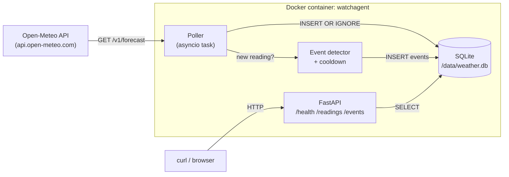

# WatchAgent — Weather Monitor & Notable-Event Detector

WatchAgent polls live weather for **Ottawa, Toronto, and Vancouver** every
few minutes, decides when a reading is worth paying attention to, and stores
both the raw readings and the detected events. Everything is exposed through
a small HTTP API.

The hard part of this kind of system is not collecting data — it is deciding
what matters. The bulk of this README is therefore the [event detection
design](#event-detection-design) and the [Cursor setup](#cursor-setup) that
keeps the design defensible as the code changes.

---

## Table of contents

- [System overview](#system-overview)
- [Architecture](#architecture)
- [Running it](#running-it)
- [API reference](#api-reference)
- [Running tests](#running-tests)
- [Technology choices](#technology-choices)
- [Event detection design](#event-detection-design)
- [Cursor setup](#cursor-setup)
- [Project layout](#project-layout)

---

## System overview

A single Python process runs a FastAPI app and an asyncio background poller.
Every `POLL_INTERVAL_SECONDS` (default 300) the poller fetches the current
weather for each city from Open-Meteo, inserts the reading into SQLite
(deduplicating on `(city, observed_at)`), and — only if the row is new —
runs the event detectors. Detected events that survive the cooldown filter
are written to the `events` table. The same process serves `/health`,
`/readings`, and `/events` from the same SQLite file.

The database lives on a named Docker volume so data survives container
restarts.

## Architecture



ASCII fallback:

```
                 +---------------------+
                 |   Open-Meteo API    |
                 +----------+----------+
                            |
                            v
+---------------------------+---------------------------+
|                   watchagent container                |
|                                                       |
|   +---------+      +-----------+     +-----------+    |
|   | Poller  +----->| Dedup +   +---->|  SQLite   |    |
|   | (async) |      | Detector  |     | weather.db|    |
|   +---------+      +-----------+     +-----+-----+    |
|                                            ^         |
|                                            |         |
|                          +---------+-------+-----+   |
|                          | FastAPI app (uvicorn) |   |
|                          +-----------+-----------+   |
+--------------------------------------+---------------+
                                       ^
                                       |
                                  curl / browser
```

## Running it

Requires only Docker and Git.

```bash
git clone <this-repo>
cd watchagent
cp .env.example .env
docker compose up --build
```

After a few seconds the API is at `http://localhost:8000`:

```bash
curl http://localhost:8000/health
# {"status":"ok","readings_stored":0,"events_stored":0}
```

The poller runs every `POLL_INTERVAL_SECONDS` (default 300 s). Because
Open-Meteo only refreshes once per hour, the practical new-reading rate is
about one row per city per hour ≈ 72 readings per day.

### Configuration

All knobs are in `.env.example`. Override by editing `.env` (which is in
`.gitignore` and never committed).

| Variable                 | Default              | Meaning                                          |
| ------------------------ | -------------------- | ------------------------------------------------ |
| `POLL_INTERVAL_SECONDS`  | `300`                | Seconds between poll cycles.                     |
| `POLL_MAX_RETRIES`       | `3`                  | Retries per city per cycle before giving up.     |
| `POLL_RETRY_BACKOFF`     | `1.0`                | Base seconds for exponential backoff.            |
| `DB_PATH`                | `/data/weather.db`   | SQLite path inside the container.                |
| `LOG_LEVEL`              | `INFO`               | `DEBUG` / `INFO` / `WARNING` / `ERROR`.          |

### Data persistence

`docker-compose.yml` mounts the named volume `weather-data` at `/data`.
Restarting the container preserves the database; removing the volume
(`docker compose down -v`) drops it.

## API reference

Three endpoints, contracts taken verbatim from the challenge spec.

### `GET /health`

```bash
curl -s http://localhost:8000/health | jq
```

```json
{
  "status": "ok",
  "readings_stored": 142,
  "events_stored": 7
}
```

### `GET /readings`

```bash
curl -s "http://localhost:8000/readings?city=Ottawa&limit=3" | jq
```

```json
{
  "readings": [
    {
      "id": 142,
      "city": "Ottawa",
      "observed_at": "2026-05-27T18:00:00+00:00",
      "temperature_c": 23.4,
      "apparent_temperature_c": 22.1,
      "precipitation_mm": 0.0,
      "wind_speed_kmh": 14.2,
      "weather_code": 2,
      "fetched_at": "2026-05-27T18:01:03.214120+00:00"
    }
  ]
}
```

Query params:

- `city` — optional. One of `Ottawa`, `Toronto`, `Vancouver`. Unknown values return `400`.
- `limit` — optional, default `50`, range `[1, 500]`.

Results are most-recent first.

### `GET /events`

```bash
curl -s "http://localhost:8000/events?limit=2" | jq
```

```json
{
  "events": [
    {
      "id": 7,
      "city": "Vancouver",
      "observed_at": "2026-05-27T17:00:00+00:00",
      "event_type": "precip_onset",
      "severity": "info",
      "value": 3.2,
      "baseline": 0.0,
      "reason": "Precipitation started in Vancouver: 0.0 -> 3.2 mm/h.",
      "reading_id": 139
    }
  ]
}
```

Same query params as `/readings`. Every event answers *what happened, in
which city, when, and why* — `event_type`, `city`, `observed_at`, and
`reason` respectively.

### OpenAPI

FastAPI exposes an automatically generated OpenAPI spec at
`http://localhost:8000/docs` (Swagger UI) and `/openapi.json`.

## Running tests

The test suite uses `pytest` + `pytest-asyncio` and mocks the Open-Meteo
HTTP calls with `respx` — no network access required.

```bash
pip install -e ".[dev]"
pytest -q
```

CI runs the same command on every push to `main`.

### What the tests cover

| File                       | What it asserts                                                                                         |
| -------------------------- | ------------------------------------------------------------------------------------------------------- |
| `tests/test_dedup.py`      | Identical readings only insert once, both at the `Storage` layer and end-to-end through the poller.    |
| `tests/test_events.py`     | Each detector fires when it should and stays silent when it shouldn't; cooldown blocks repeat events.  |
| `tests/test_api.py`        | `/health`, `/readings`, `/events` return the documented shape against a seeded DB; city filter validates. |

## Technology choices

| Choice                    | Why                                                                                                                                                                                                                                                                                                                       |
| ------------------------- | ------------------------------------------------------------------------------------------------------------------------------------------------------------------------------------------------------------------------------------------------------------------------------------------------------------------------- |
| **FastAPI**               | Native async fits the polling workload (the poller and the API share an event loop, no thread pool). Pydantic response models double as the API contract, validated on the way out. Auto-generated OpenAPI is free debugging. Flask would also work; the async + typed-contract combination is what tipped it to FastAPI. |
| **SQLite (`aiosqlite`) + WAL** | The spec only requires that the DB persists across container restarts. SQLite on a mounted volume does that. At 3 cities × 1 reading/hour ≈ 72 rows/day, a Postgres container would add a dependency for no operational benefit. WAL mode lets the API read concurrently with poller writes.                       |
| **Single container**      | The poller runs as an asyncio task inside the API process, started from FastAPI's `lifespan`. One process to debug, one log stream, no message bus needed. The poller code lives in its own module so it could be split into a separate service later without rewriting the detectors or storage.                          |
| **`httpx`**                | Async HTTP client with the cleanest API; `respx` mocks it cleanly in tests.                                                                                                                                                                                                                                                |
| **`pydantic-settings`**    | Type-checked env-var loading; one source of truth (`config.Settings`) instead of `os.environ.get` scattered across modules.                                                                                                                                                                                                |
| **Plain `pip` install in the Dockerfile** | The project ships a standard `pyproject.toml`; no need to introduce `uv` or `poetry` as a build dependency for a small repo. The multi-stage build still keeps build tooling out of the final image.                                                                                                          |
| **GitHub Actions**         | Free shared runners, no infra to manage. Two jobs: `test` (pytest) and `build` (docker build).                                                                                                                                                                                                                              |

## Event detection design

The brief explicitly warns against "fire when temperature > 30°C" — and also
against "no events at all" or "events that never stop firing". The design
below is structured around four different signal shapes, because using the
same approach for all five fields would produce one of those failure modes.
The first three look at a single field; the fourth looks at *combinations* of
fields (and, for heat stress, at the city's seasonal climate).

### Detector families

#### 1. Per-city contextual anomaly (temperature)

> `25°C` in Vancouver in February is dramatic. The same value in Ottawa in
> July is unremarkable.

Implemented in `detect_temperature_anomaly`. For each new reading we:

1. Pull the most recent `ROLLING_WINDOW = 24` readings for that city
   (i.e. roughly the last day).
2. Compute the mean and population standard deviation of `temperature_c`.
3. Fire `temperature_anomaly` if `|z| ≥ Z_THRESHOLD` **and**
   `|reading - mean| ≥ MIN_ABS_DELTA_C`.

The second condition is the important one. On a flat day the standard
deviation collapses, so a tiny variation can look like many σ. The
`MIN_ABS_DELTA_C = 5°C` guard says "we only care if it's also a meaningful
absolute change". The pair together catches the Vancouver-in-February case
while ignoring sensor wiggle.

Tunables (see `src/watchagent/events.py`):

| Constant                  | Value | Why this value                                                                       |
| ------------------------- | ----- | ------------------------------------------------------------------------------------ |
| `ROLLING_WINDOW`          | `24`  | Approximately one day at Open-Meteo's hourly cadence.                                |
| `MIN_WINDOW_FOR_BASELINE` | `6`   | Below this we don't trust the stddev; the detector returns silently.                 |
| `Z_THRESHOLD`             | `2.0` | Roughly the upper 2.5% tail of a normal distribution.                                |
| `MIN_ABS_DELTA_C`         | `5.0` | A change a person would actually notice walking outside.                             |

We use `temperature_c`, not `apparent_temperature_c`, because the apparent
value already blends wind and humidity and would double-count with the wind
detector.

#### 2. Rate-of-change spike (wind, precipitation)

Wind and precipitation are *bursty* — they don't drift, they jump. A
rolling stddev poisons itself: a single gust raises the baseline for hours
and silences future detection.

So we compare to the immediately previous reading for that city instead.

- `wind_spike` fires when the new wind speed is at least
  `WIND_SPIKE_DELTA_KMH = 25 km/h` higher than the previous reading **and**
  the new value is at least `WIND_SPIKE_MIN_KMH = 30 km/h`. The lower bound
  on the absolute value stops us firing on "gusty calm" (0 → 25 km/h).
- `precip_onset` fires when the previous reading had
  `precipitation_mm ≤ PRECIP_ONSET_BASELINE_MM = 0.2` and the new one is
  `≥ PRECIP_ONSET_TRIGGER_MM = 2.0`. That's the start of meaningful rain,
  not a passing sprinkle.

#### 3. Categorical / cross-city (weather codes)

Two detectors here, both keyed on WMO `weather_code`.

- `severe_weather` fires unconditionally on codes in
  `SEVERE_WEATHER_CODES`: `{65 heavy rain, 66/67 freezing rain, 75 heavy
  snow, 82 violent rain showers, 95/96/99 thunderstorm}`. These are
  inherently notable; there's nothing context-dependent about a
  thunderstorm in any of our cities.
- `synchronized_weather` fires when **every** monitored city reports the
  same non-trivial WMO code. The same calm partly-cloudy code shared across
  three cities is not news, so codes `{0, 1, 2, 3}` are excluded. Three
  cities all reporting "light rain" simultaneously, however, is a
  coordinated weather system worth surfacing.

#### 4. Compound & region-aware (attribute combinations)

The single-field detectors miss situations that only matter when two
attributes coincide. These three read **multiple fields together**:

- `storm` fires when `wind_speed_kmh ≥ STORM_WIND_KMH = 35` **and**
  `precipitation_mm ≥ STORM_PRECIP_MM = 2`. A dry gale is just a `wind_spike`
  and a calm downpour is just `precip_onset`; the *combination* is a storm.
- `freezing_rain` fires when `temperature_c ≤ FREEZING_TEMP_C = 1` **and**
  `precipitation_mm ≥ FREEZING_PRECIP_MM = 0.2`. This catches freezing-rain
  risk from the measurements even when the upstream WMO code didn't label it
  (it complements the code-based `severe_weather`).
- `heat_stress` is the **region-aware** one. It fires only when all three of:
  the reading is genuinely warm (`temperature_c ≥ HEAT_ABS_MIN_C = 20`),
  there is a humidity load (`apparent − actual ≥ HEAT_APPARENT_GAP_C = 3`,
  our proxy for humidity since we don't store it directly), **and** the
  temperature is hot for *this city's season*
  (`z ≥ HEAT_SEASONAL_Z = 1` against the per-city monthly normal in
  `src/watchagent/climate_normals.json`). That seasonal term is what makes the
  same humid 25°C a non-event in Toronto in July but notable in a city/season
  where it's unusual. When no prior exists for a city it falls back to the
  warmth + humidity test.

| Constant               | Value | Field(s) it reads                          |
| ---------------------- | ----- | ------------------------------------------ |
| `STORM_WIND_KMH`       | `35`  | wind + precip                              |
| `STORM_PRECIP_MM`      | `2.0` | wind + precip                              |
| `FREEZING_TEMP_C`      | `1.0` | temp + precip                              |
| `FREEZING_PRECIP_MM`   | `0.2` | temp + precip                              |
| `HEAT_ABS_MIN_C`       | `20`  | temp + apparent + seasonal normal          |
| `HEAT_APPARENT_GAP_C`  | `3.0` | temp + apparent (humidity proxy)           |
| `HEAT_SEASONAL_Z`      | `1.0` | temp vs per-city monthly normal            |

### Cooldowns

A heat wave that lasts 24 hours should produce **one** `temperature_anomaly`
event for that onset, not 24 of them. Each event type has a cooldown defined
in `events.COOLDOWN`:

| `event_type`             | Cooldown |
| ------------------------ | -------- |
| `temperature_anomaly`    | 12 h     |
| `wind_spike`             | 6 h      |
| `precip_onset`           | 6 h      |
| `severe_weather`         | 6 h      |
| `synchronized_weather`   | 12 h     |
| `storm`                  | 6 h      |
| `freezing_rain`          | 6 h      |
| `heat_stress`            | 12 h     |

Cooldowns are scoped to `(city, event_type)`, so a wind spike in Ottawa does
not suppress a wind spike in Vancouver. The check is against the *observed*
timestamps, not wall-clock time, so replaying historical data produces the
same events that the live system would have produced.

### What each event stores

Every row in `events` has a `city`, `observed_at`, `event_type`, `severity`
(one of `info` / `warning` / `critical`), a `reason` string written for a
human, optional numeric `value` and `baseline` (so a client can compute the
delta without parsing `reason`), and the `reading_id` that triggered it.

### Things this design deliberately does not do

- **No machine learning.** With ~72 readings per city per day, there is no
  meaningful training set within the lifetime of the running container.
- **No alerting / notification.** Out of scope — the events table is the
  product; clients poll `/events`.
- **No re-evaluation of historical data when thresholds change.** Replay
  is offered as a Cursor skill (see below) for that workflow.

## Cursor setup

The `.cursor/` folder is part of the deliverable. Everything in it is tied
to a concrete decision in this codebase — there are no generic "write clean
code" rules.

### Rules (`.cursor/rules/`)

| File                                | What it enforces                                                                                                                                                                                                                       |
| ----------------------------------- | -------------------------------------------------------------------------------------------------------------------------------------------------------------------------------------------------------------------------------------- |
| `poller-error-handling.mdc`         | A failed Open-Meteo fetch is logged at `WARNING` with `city`, `http_status`, `retry`, `error` and never raises out of the poll loop. Retries use exponential backoff with `POLL_RETRY_BACKOFF`. This is the concrete contract that makes the poll loop survive flaky upstreams. |
| `event-record-shape.mdc`            | Every `NewEvent` populates `city`, `observed_at`, `event_type`, `severity` ∈ `{info, warning, critical}`, `reason` (≤200 chars), and `reading_id` when applicable. New `event_type` values must have an entry in `events.COOLDOWN` and at least one positive and one negative test. |
| `logging-contract.mdc`              | One logger name per module (`watchagent.<module>`), no f-strings in log messages, stable field names across calls (`city`, `event_type`, …), level discipline (`DEBUG`/`INFO`/`WARNING`/`ERROR`). Makes the logs grep-able.                                                       |
| `db-access.mdc`                     | Routes, the poller, and tests never import `aiosqlite` or `sqlite3` directly — everything goes through `Storage`. The single exception is Cursor skills, which read with `sqlite3` because they run outside the API process. New queries get a named method and a test.            |
| `architecture-patterns.mdc`         | The design patterns each module embodies and must preserve: Adapter (`openmeteo.py`), Facade/Repository (`storage.py`), a Strategy + pipeline of pure detectors (`events.py`), Dependency Injection at the composition root (`main.py`), and a fan-out/fan-in + guarded-suspension concurrency model (`poller.py`). |
| `consistency-and-failure-model.mdc` | The CAP trade-off (AP toward Open-Meteo, CP on a single-node WAL store) and the invariants that dedup, backfill, and replay rely on: idempotent `INSERT OR IGNORE` writes keyed on `(city, observed_at)`, event-time (not wall-clock) ordering and cooldown, stale-tolerant reads, and a single-writer assumption. |

### Agent (`.cursor/agents/event-logic-reviewer.md`)

A scoped reviewer for changes to `src/watchagent/events.py` and
`tests/test_events.py`. Its system prompt encodes:

- the three detector families and why each exists,
- the firing-rate budget (≈72 readings/city/day, 3 cities),
- the cooldown requirement,
- the field-shape contract from `event-record-shape.mdc`,
- the testing contract (positive + negative + threshold-edge),
- the boundary: it does **not** touch `storage.py`, `poller.py`, or the API.

Output is a numbered list of issues followed by `APPROVE` /
`REQUEST_CHANGES`. It exists because the easiest way to silently degrade
this system is by lowering a threshold without thinking about firing rate;
the agent's job is to make that hard to do by accident.

### Skills (`.cursor/skills/`)

#### `analyze_data` — the graded data-analysis skill

`python .cursor/skills/analyze_data/analyze.py --question <id> [--db PATH] [--city CITY] [--hours N]`

Opens the SQLite database **read-only** (`mode=ro` URI) and answers
canonical questions:

| `--question`          | Returns                                                                  |
| --------------------- | ------------------------------------------------------------------------ |
| `event-counts`        | Per-city event totals, broken out by `event_type`.                       |
| `temperature-trend`   | Per-city mean / min / max temperature over the window.                   |
| `time-window`         | Readings + events in the window, grouped by city.                        |
| `synchronized`        | List of `synchronized_weather` events with their WMO code.               |
| `event-types`         | Total count per event type across all cities.                            |
| `dedup-check`         | Verifies `(city, observed_at)` uniqueness; flags any anomalies.          |
| `attribute-summary`   | Per-city distribution (mean/min/max/p10/p50/p90) for **all** measured attributes + decoded weather-code mix. |
| `compound-conditions` | Co-occurring severe attributes per city (storm = wind+rain, freezing-rain risk = cold+precip, heat stress = heat+humidity gap, wind chill). |
| `regional-baseline`   | Region- and season-aware temperature baseline: data-driven from stored history, falling back to per-city climate priors, scoring the latest reading. |

The last three answer the "do attribute *combinations* mean something, and is
this reading extreme *for this region*?" questions that single-attribute
aggregates miss. `compound-conditions` reads two-or-more attributes together
(e.g. high wind **and** heavy precipitation); `regional-baseline` uses
`src/watchagent/climate_normals.json` so `25 °C` is judged differently in
maritime Vancouver than in continental Ottawa, and degrades gracefully when
the DB has little history.

Stdout is a JSON object with a stable envelope: `question`, `window_hours`,
`city`, `generated_at`, `result`. Uses only the stdlib so it runs without
installing the `watchagent` package.

Example:

```bash
$ python .cursor/skills/analyze_data/analyze.py --question event-counts
{
  "question": "event-counts",
  "result": {
    "by_city": {
      "Ottawa": { "temperature_anomaly": 1 },
      "Vancouver": { "severe_weather": 1 }
    },
    "totals": { "Ottawa": 1, "Vancouver": 1 }
  },
  ...
}
```

#### `replay_events` — threshold-tuning helper

`python .cursor/skills/replay_events/replay.py [--db PATH] [--per-city N]`

Loads the last N readings per city from the live DB and pipes them back
through the **current** detector code path (the same `candidate_events` +
`apply_cooldown` that the poller uses). Nothing is written. Output is a
JSON summary: total readings replayed, total would-fire count, breakdown
by type and city, and a sample of 20 events with reasons.

Use it to answer "if I lower `Z_THRESHOLD` from 2.0 to 1.5, does the
event stream explode?" before committing the change. Requires the
`watchagent` package importable (run from a venv where `pip install -e .`
has been done).

## Project layout

```
.
├── .cursor/
│   ├── rules/                       # active conventions
│   │   ├── poller-error-handling.mdc
│   │   ├── event-record-shape.mdc
│   │   ├── logging-contract.mdc
│   │   └── db-access.mdc
│   ├── agents/
│   │   └── event-logic-reviewer.md
│   └── skills/
│       ├── analyze_data/{SKILL.md, analyze.py}
│       └── replay_events/{SKILL.md, replay.py}
├── .github/workflows/ci.yml         # test + build jobs
├── src/watchagent/
│   ├── api/{routes.py, schemas.py}
│   ├── config.py                    # cities, env-var settings
│   ├── events.py                    # the three detector families + cooldown
│   ├── logging_setup.py             # structured-ish stdout logging
│   ├── main.py                      # FastAPI app, lifespan wires it all up
│   ├── openmeteo.py                 # HTTP client + response parsing
│   ├── poller.py                    # background poll loop with retries
│   └── storage.py                   # sole owner of aiosqlite access
├── tests/
│   ├── conftest.py
│   ├── test_dedup.py
│   ├── test_events.py
│   └── test_api.py
├── Dockerfile                       # multi-stage, non-root, slim runtime
├── docker-compose.yml               # named volume for persistence
├── pyproject.toml
├── .env.example
└── README.md
```
